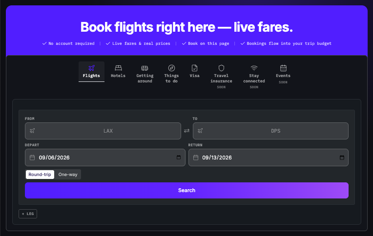

# Temple Stuart

**Temple Stuart — track your money, plan your time, book your trips, grade your trades. One app, one set of books.**

**[Try it free — no account](https://templestuart.com)**

---

## What's inside

| Module | What it does |
|---|---|
| **Travel** | Search, book, and budget your trips in one place. |
| **Runway** | See how many months your money lasts. |
| **Books** | Know where every dollar went — synced straight from your bank. |
| **Trade** | Find trades worth taking — and get told when to skip. |
| **Tax** | Your return builds itself from your records. |
| **Compliance** | Every number keeps its receipt — proof you can show later. |
| **Routines** | Set up a habit once — it lands on your calendar and your budget. |
| **Projects** | Type a goal — get a plan you can actually run. |
| **Content** | Turn what you did today into a ready-to-film script. |

## The trading scanner

Live prices from TastyTrade. Synced from your broker. Every trade lands in your books.

The scanner scores an entire index, shows its work step by step, and generates trade cards you can
link to real positions — then grades you: a self-graded track record with the max-loss integrity
check (how many linked trades stayed within their card's stated max loss). Data, not advice.

> Data and analytics only — not investment advice or a recommendation. All metrics are
> computed from market data; you make all trading decisions. Options involve substantial
> risk of loss.

## Self-hosting (free for personal use)

You need: **Node 20+**, **PostgreSQL**, and a host (built for Vercel). Then the keys.

| Vendor / concern | Keys | Needed when |
|---|---|---|
| Core | `DATABASE_URL`, `JWT_SECRET`, `NEXTAUTH_SECRET`, `ADMIN_PASSWORD`, `OWNER_EMAIL`, `NEXT_PUBLIC_OWNER_EMAIL`, `NEXT_PUBLIC_APP_URL`, `NEXT_PUBLIC_BASE_URL` | Required |
| Plaid (bank sync) | `PLAID_CLIENT_ID`, `PLAID_SECRET` | Required unless Books sync disabled |
| Stripe (payments) | `STRIPE_SECRET_KEY`, `STRIPE_WEBHOOK_SECRET`, `NEXT_PUBLIC_STRIPE_PUBLISHABLE_KEY`, `STRIPE_PRO_PRICE_ID`, `STRIPE_PRO_PLUS_PRICE_ID`, `STRIPE_TAB_<MODULE>_PRICE_ID` (per sellable module) | Required to sell modules; skip to run everything unlocked-free |
| Flights (Duffel) | `DUFFEL_API_TOKEN`, `DUFFEL_ALLOW_LIVE_BOOKING`, `NEXT_PUBLIC_DUFFEL_ENABLED`, `FLIGHTS_LANE` | Required unless flights disabled |
| Stays (Nuitée liteAPI) | `LITEAPI_SANDBOX_KEY`, `LITEAPI_PRODUCTION_KEY`, `LITEAPI_MODE` | Required unless hotels disabled |
| Tours (Viator) | `VIATOR_API_KEY` | Required unless activities disabled |
| Visa rules (RapidAPI) | `RAPIDAPI_VISA_KEY`, `RAPIDAPI_VISA_HOST` | Required unless visa check disabled |
| Places / maps | `GOOGLE_PLACES_API_KEY`, `GOOGLE_PLACES_MONTHLY_CAP`, `PLACES_CACHE_TTL_DAYS` | Key required unless location search disabled; caps optional |
| Markets (TastyTrade) | `TASTYTRADE_CLIENT_SECRET`, `TASTYTRADE_REFRESH_TOKEN`, `TT_USERNAME`, `TT_PASSWORD` | Required unless Trade disabled |
| Market data | `FINNHUB_API_KEY`, `FRED_API_KEY` | Required unless the scanner is disabled (the code fails loud: "FINNHUB_API_KEY not configured") |
| AI | `ANTHROPIC_API_KEY`, `OPENAI_API_KEY`, `XAI_API_KEY`, `VOYAGE_API_KEY` | Required unless the AI features are disabled |
| Email (Resend) | `RESEND_API_KEY`, `EMAIL_FROM` | Required unless email disabled |
| Jobs (Inngest) | `INNGEST_EVENT_KEY`, `INNGEST_SIGNING_KEY` | Required unless background jobs disabled |
| OAuth sign-in | `GOOGLE_CLIENT_ID`, `GOOGLE_CLIENT_SECRET`, `GITHUB_CLIENT_ID`, `GITHUB_CLIENT_SECRET` | Optional (email login works without) |
| Routine/audit hooks | `CRON_SECRET`, `ROUTINE_AUDIT_TOKEN`, `ROUTINE_AUDIT_FIRE_URL`, `EXEC_ROUTINE_TOKEN`, `EXEC_ROUTINE_FIRE_URL`, `EXEC_INGEST_SECRET`, `AUDIT_INGEST_SECRET` | Required unless scheduled routines disabled |
| Rate limits & caps | `SEARCH_RATE_LIMIT`, `SEARCH_RATE_WINDOW`, `BOOK_RATE_LIMIT`, `BOOK_RATE_WINDOW`, `SCAN_RATE_LIMIT`, `SCAN_RATE_WINDOW`, `AI_RATE_LIMIT`, `AI_RATE_WINDOW`, `AI_PIPE_DAILY_CAP`, `AI_EXEC_DAILY_CAP`, `AI_ROUTINE_DAILY_CAP`, `TRAVEL_SEARCH_DAILY_CAP` | Optional (code defaults) |
| Misc | `YELP_API_KEY` | Required unless its feature is disabled |

Yes, that's a lot of keys. That's why the next section exists.

## Work with me

I built this for me — but I'll set it up for you.

- Done-for-you setup: your own hosted copy, every API wired, you own everything.
- Maintenance: I keep it updated and running.
- Custom builds: need a feature? I build it.

Email astuart@templestuart.com with what you need.

## License

Source-available under BSL 1.1 — free to self-host for personal use. Commercial use or a
done-for-you setup → astuart@templestuart.com

---

Temple Stuart is not a CPA firm, tax preparer, or licensed financial advisor.
All tax figures generated by this platform are estimates for informational purposes only
and must be verified by a qualified tax professional before filing.
Use of this software does not constitute tax advice.
